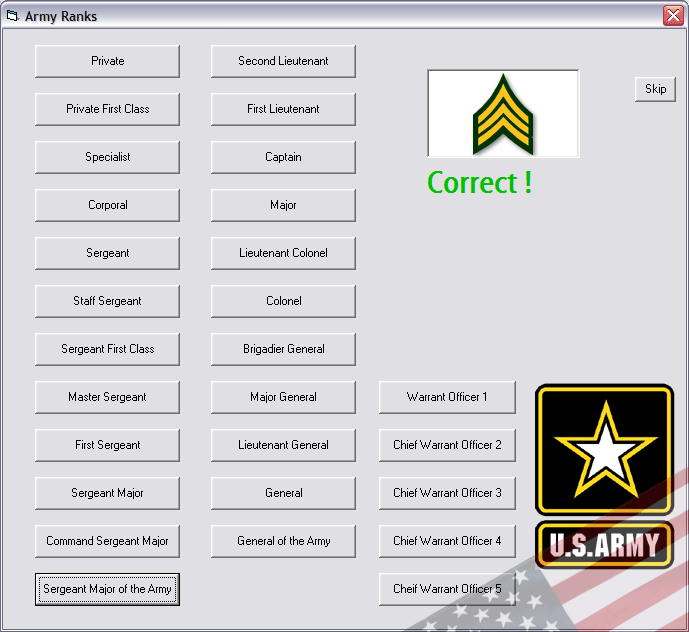



## Army Ranks

### Description

Learn what all the ranks are based on the Insignia on the uniform. For now I have only done the Army. I am going into the Army in 4 weeks and this method has almost allowed me to learn them all in approx 30 minutes. You can click the logo / Insignia at anytime to get the answer. I commented the code so it should be easy to modify.

note:

I have been trying to eliminate the ones chosen but Im not sure how to get the random function exclude numbers, if anyone can help me on this it would be greatly appreciated.
 
### More Info
 

             |
---                |---
**Submitted On**   |2006-05-24 00:48:28
**By**             |[snowboardr](https://github.com/Planet-Source-Code/PSCIndex/blob/master/ByAuthor/snowboardr.md)
**Level**          |Intermediate
**User Rating**    |4.8 (24 globes from 5 users)
**Compatibility**  |VB 5\.0, VB 6\.0
**Category**       |[Complete Applications](https://github.com/Planet-Source-Code/PSCIndex/blob/master/ByCategory/complete-applications__1-27.md)
**World**          |[Visual Basic](https://github.com/Planet-Source-Code/PSCIndex/blob/master/ByWorld/visual-basic.md)
**Archive File**   |[Army\_Ranks1996505242006\.zip](https://github.com/Planet-Source-Code/snowboardr-army-ranks__1-65459/archive/master.zip)

